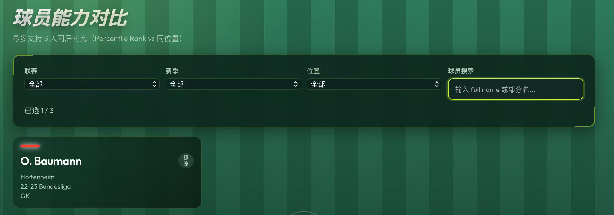
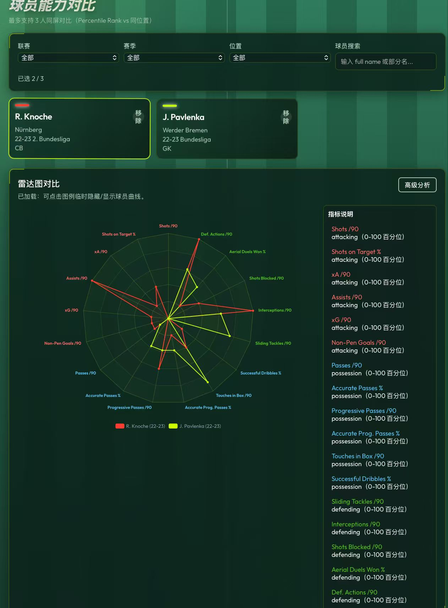

# SouthEast-Scouting

基于 `Spring Boot + PostgreSQL + Redis` 的球员检索与能力对比 Demo，当前仓库内已经包含：

- 球员搜索与筛选
- 最多 3 人同屏对比
- 雷达图指标对比
- 静态前端 Demo 页面
- 数据库迁移脚本与 Docker 依赖服务配置

## 页面效果

### 搜索与选人



### 雷达图对比



## 项目结构

- 页面入口：`src/main/resources/static/player-compare-demo.html`
- 样式文件：`src/main/resources/static/css/player-compare-demo.css`
- 前端逻辑：`src/main/resources/static/js/player-compare-demo.js`
- Mock 数据：`src/main/resources/static/js/mock-data.js`
- 数据库迁移：`src/main/resources/db/migration/`
- Spring Boot 启动类：`src/main/java/com/southeast/scouting/SouthEastScoutingApplication.java`

## 运行要求

推荐准备以下环境：

- Docker Desktop
- Docker Compose

可选本机环境：

- Java 17
- Maven 3.9+

## 配置说明

应用默认读取以下连接配置，未显式设置时会使用这些默认值：

- PostgreSQL：`jdbc:postgresql://localhost:5432/southeast_sc`
- PostgreSQL 用户：`se_user`
- PostgreSQL 密码：`se_pass`
- Redis：`localhost:6379`

对应配置文件见：`src/main/resources/application.properties`

## 推荐启动方式

这是目前最贴近实际可运行状态的启动方式，适合本机没有配置 Java 17 的情况。

### 1. 启动 PostgreSQL 和 Redis

在项目根目录执行：

```powershell
docker compose up -d postgres redis
```

### 2. 使用 Docker 中的 Maven + JDK 17 启动应用

```powershell
docker run -d `
  --name se_app `
  -p 8080:8080 `
  -e DB_URL=jdbc:postgresql://host.docker.internal:5432/southeast_sc `
  -e DB_USER=se_user `
  -e DB_PASSWORD=se_pass `
  -e REDIS_HOST=host.docker.internal `
  -e REDIS_PORT=6379 `
  -v se_m2:/root/.m2 `
  -v "${PWD}:/app" `
  -w /app `
  maven:3.9.9-eclipse-temurin-17 `
  mvn "-Dmaven.wagon.http.retryHandler.count=5" -B spring-boot:run
```

说明：

- `se_m2` 会缓存 Maven 依赖，首次启动慢，后续会快很多。
- 首次启动可能需要较长时间下载依赖并编译。
- 如需查看日志：

```powershell
docker logs -f se_app
```

### 3. 访问页面

启动成功后访问：

- `http://localhost:8080/player-compare-demo.html`
- `http://localhost:8080/actuator/health`

## 本机 Java 方式启动

如果你的机器已经安装并配置好 `Java 17`，可以直接运行：

```powershell
.\mvnw.cmd spring-boot:run
```

或：

```powershell
mvn spring-boot:run
```

## 常用命令

### 查看依赖服务状态

```powershell
docker ps --format "table {{.Names}}\t{{.Status}}\t{{.Ports}}"
```

### 停止应用容器

```powershell
docker rm -f se_app
```

### 停止 PostgreSQL 和 Redis

```powershell
docker compose down
```

### 运行测试

```powershell
.\mvnw.cmd test
```

## 常见问题

### 1. 本机没有 Java，`.\mvnw.cmd spring-boot:run` 无法执行

表现通常是：

```text
java : The term 'java' is not recognized...
```

处理方式：

- 安装并配置 `Java 17`
- 或直接使用上面的 Docker 化启动方式

### 2. Docker Desktop 没启动

表现通常是：

```text
failed to connect to the docker API
```

处理方式：

- 先启动 Docker Desktop
- 等待 Docker 引擎完全就绪后再执行 `docker compose up -d postgres redis`

### 3. 首次启动依赖下载较慢或偶发中断

这是 Maven 首次从中央仓库拉依赖时的常见现象。建议：

- 保留 `se_m2` 缓存卷
- 重新执行同一条 `docker run` 命令重试

## 相关文件

- Docker 依赖服务：`docker-compose.yml`
- Maven 配置：`pom.xml`
- 环境变量示例：`.env.example`
